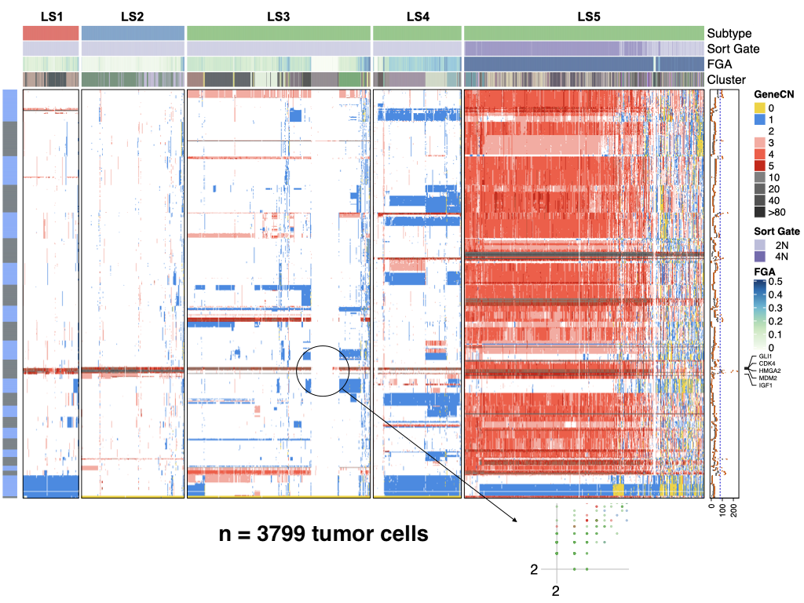
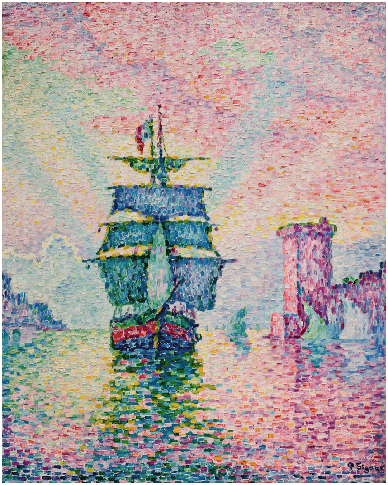

toSignac: The open-source simple integrative genetic analysis of cells/copynumber
---
***

### beta- release

I am working to integrate a core set of extensions that can deliver a formal end-to-end analysis by implementin proven quantitative genetics, statistics, and evolutionary models on the backend of the functions.  Henderson's Animal Model **_y_** = _**X**ß_ + _**Z**µ_ + _e_ quantitative genetics is well suited to apply a linear mixed models framework for the analysis of same-cell DNA + RNA sequencing technologies such as G+T ([Macaulay, et al.2015](https://dx.doi.org/10.1038/nmeth.3370)), and multiplexed immunohistochemistry.  If you would like to contribute to this endevor, please feel free to reach out.  We have real world data that we are willing to share. My hope is that others will find this package helpful for their DNA copy number needs as well.

Please report any bugs you may encounter. Help me me, help you.

toSignac is an, open-source, simple, lightweight, R framework for quantitative analysis of single-cell genomic data.  Inspired, but unlike Seurat and Scanpy --which implement methods for transcriptomic analysis, toSignac is designed to work single-cell genomic data (DNA).  It does this by adapting the logic of espressioSet/AnnData into relational matrices in native R.  This keeps the toolkit easy to learn, hard to master;  and will facilitate integration of new algorithms for the downstream analysis of single-cell DNA data wich is so desperately needed.  The framework is abstract enought that can be used with other types of rectangular Phenotype ~ Gentoype realtionships e.g. it could be used with a numeric representation of the genotype matrix.  For now toSignac facilitates the downstream analyses of segmented data with common segments by concurrently managing the X, Y across all cells or samples e.g. the output of [Varbin/Ginkgo](https://github.com/robertaboukhalil/ginkgo), [FACETS](https://github.com/mskcc/facets), [MUMdex](http://mumdex.com), [HMMcopy](https://bioconductor.org/packages/release/bioc/html/HMMcopy.html), or [SCOPE](https://github.com/rujinwang/SCOPE).  The bin read counts is _not a correct_ input.  toSignac uses integrated [ComplexHeatmap](https://jokergoo.github.io/ComplexHeatmap-reference/book/), an ultra-powerful tool for heatmaps to help visualize the data.

# Dependencies:
 - [ComplexHeatmap](https://jokergoo.github.io/ComplexHeatmap-reference/book/)
 - [tidyverse](https://www.tidyverse.org)
 - [vegan](https://github.com/vegandevs/vegan)
 - [colorvalues](https://symbolixau.github.io/colourvalues/)
 
 
# Installation
 
    install.packages("devtools")
    devtools::github_install("https://github.com/SingerLab/toSignac/")
    

# Simple run:

    data(cnr)
   
    HeatmapCNR(cnr)
   
    HeatmapCNR(cnr, what = "genes", which.genes = c("CKD4", "MDM2"))

# Description

toSignac simplifys the analysis DNA information by keeping multiple sources of information to genomic / positional coordinates syncronized.  To get started you need an X matrix of copy number data (bins[i] x cells[j]), phenotypic data, the bin end-coordinates, and a gene index. Some form of metadata is also required, e.g. QC metrics are required to help interpret results in

# toSignac joins the fight against cancer.  Illustrating the complex hetereogeneity of soft-tissue sarcomas in 3799 tumor cell genomes!

See it in action: Poster #92 at The Biology of Genomes 2020 #CSHL #BoG20

**Figure 1** The heatmap above is showing the results of five different sacromas.  From left to right we observe an increasing gradient of genomic complexity culminating in a tetraploid tumor where the diploid cells are significantly deteriorated, forcing a tetraploid phenotpye to maintain the tumor mass.  This figure showing only the tumor cells. The complete data set for these five tumors approximates >9000 cells, which also contains the tumor ecosystem e.g. stroma and tumor infiltrate.

# Simple

toSignac is a simple framework to handle interelated genomic data with minimal software dependencies.  toSignac works by providing 5, easy to format tables as `data.frame` objects.  It preserves the native `data.frame` class, and preserves the `list` class, though we refer to it as a `CNR` bundle, **Copy Number, Rounded**.

Import your data using classic well known R functions such as `read.table`, `readRDS`, etc. toSignac's build functions `buildCNR`, and `buildDNA` will get you started after that.

# Integrative

toSignac is integrative in many ways for example:

* Integration of gentoype-phenotype
  + The CNR bundle simplifies the management of multiple data structures.
  
* Integration to the R/Language and Enviroment
  + Preserving native R classes in the objects facilitates inter- operability with numerous readily available packages in an intuitive way. For example, creating heatmaps with HeatmapCNR uses the ultra powerful ComplexHeatmap package by providing only a wraper for the CNR with minimal defalut settings.
  
  + If no wraper exists, or my default plot doesn't suit you, no worries, passing the data to any function only requires a `$` the `data.frame` you want to use e.g. `hist(cnr$genes[,"CDK4"])`. 
  
  + Likewise to add or replace data `cnr$Y$fga <- FACETS_fga`

  + Genetic effects, and polygenic scores can be estimated using Henderson's animal model **_y_** = _**X**ß_ + _**Z**µ_ + _e_, and your p-values can be added to the `cnr$chromInfo` for plotting (coming very soon)
  
  + If you would like to contribute an extension to toSignac, please feel free to reach out. My hope is that others find this helpful for their copy number needs too.

  + If you would like to contribute modules to this framework, we are willing to share data as a collaboration.  Please feel free to reach out if you are interested in working with us.

# Genetic analysis

* toSignac  brings in _your_ genomic data

  + R/Bioconductor is an extremely rich suite of analysis tools.  However, it is complex, and it feels like using a wrecking ball to hammer a nail, and most packages work only with human or mouse.  So if your research is in the noble field of animal genomics, plant sciences, or a brand new strain of coronaviruses, no need to spend your quarintine figuring out how to build a new genome resource.  Simply construct two simple tables 
  
     - A chromInfo.txt file to have the coordinate structure of your bins (chr, end.position)
     
     - A gene.index.txt file mapping your bins (Gb in length) to genes (Mb in length)
         - Many genes are contained in a single bin, to break them appart, you need to increase the resolution by increasing bins in the upstream segmentation analysis, not artificially in this file.
  

# Cells/Copynumber

* Cells are the single fundamental unit of biology. In their most complex form, a cell can be an organism on it's own, and in their simplest form, who am I kidding, cells are never simple...

* This package came out of the need to deliver some results.  During the 11th hour (more like in borrowed time), I saw I was spending 85% of my time keeping 3 tables syncornized (bins, genes, and phenotypes), 10% rendering heatmaps, and 5% actually looking at the results.  I began to think how lucky the people who only work with single-cell RNAseq are to have tools like Seurat and Scanpy, how simple and flexible those two tools are, and how nothing for DNA copy number is as powerful as the sister tools Seurat and Scanpy to manage the copy number matrix.  I eventually realized that the main diference is the restriction imposed by the genome coordinates.  While staring at the AnnData diagram I realized that for copy number data, the unit is a `bin` and the .X should be a matrix of common `bins` for all cells.  However, to make biological sense of the data, **gene level resolution** is required.  Thus, building a syncronized matrix with genes is of outmost importance.  At the 11th hour, having a gene to bin index (gene.index) allowed the flexibility to interpolate the bin data to gene level resolution and integration to the complete set of phenotypes, and QC data, but it's not the restricted to the mouse mouse or human genomes.  Cows, viruses, and plants have genomes too!

The Singer Lab single-cell wet-lab and dry-lab endevours are carried forward by a skeleton crew.  The need to have something simple that can help reduce the 85% of the time spent syncronizing bins, to genes, to phenotypes, and QC matrices capable of handling a large data set of >16,000 cells was greatly needed.  Knowing the data is growing by the week, I integrated functions to deal with the n+1 problem.  This is easier when using bins instead of .seg data.  Lastly, my background in animal genomics allowed me to borrow the succesful frameworks used in Genomic Selection in an abstract way in hopes that we can provide appropriate models for future same-cell technologies.

We hope you enjoy !

- Rodrigo, et al.

# What's in the works

* Integration of Henderson's Animal Model for the phenoype-genotype analyses

* Integration with CORE and GISTIC2 for fidning focal and recurrent events

* Integration of infScite for somatic alteration evolution

* Integration with Pathview for KEGG pathway visualization

* Appropriate clustering methods and thresholds

* support for .seg files

* Computational efficiency with S4 dispatch with defined classes

* Cleaner code with tidyverse

* CRAN testing

# Licence
toSignac framework and code is distributed under a BSD-3 License

# History

**Paul Signac**  
LA PASSE DE MARSEILLE  
Estimate  3,000,000 — 5,000,000  USD  
 LOT SOLD @ Auction by Sotheby's NYC for 6,621,400 USD   

(we should be artists)
