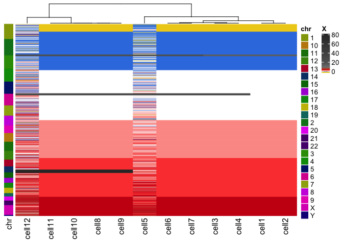
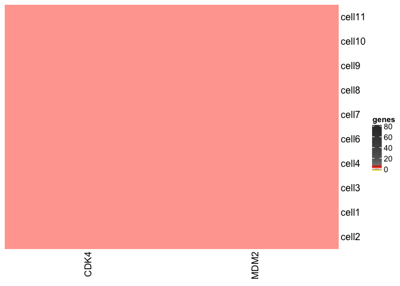

<!-- README.md is generated from README.Rmd. Please edit that file -->

## GAC: Genetic Analysis of Cells

-----

<!-- badges: start -->

[](https://www.tidyverse.org/lifecycle/#experimental)
[](https://github.com/r-lib/usethis/actions)
[](https://codecov.io/gh/r-lib/usethis?branch=master)
[](https://travis-ci.com/SingerLab/gac)
[](https://CRAN.R-project.org/package=gac)

<!-- badges: end -->

# GAC is currently in ALPHA-release

The goal of GAC is to deliver a formal end-to-end analysis by
integrating proven methods of quantitative genetics, statistics, and
evolutionary biology for the genetic analysis of single-cell DNA copy
number. GAC implements a simple, lightweight, and open-source R
framework (Figure 1). Inspired, yet unlike Seurat and Scanpy, GAC adapts the
logic of espressioSet/AnnData into relational matrices in native R. This
keeps the toolkit easy to learn, hard to master; and facilitates the
integration of algorithms for the downstream analysis of single-cell DNA
data wich is so desperately needed.  GAC facilitates the
downstream analyses of segmented data with common segments by
concurrently managing the X, Y across all cells or samples e.g. the
output of [Varbin/Ginkgo](https://github.com/robertaboukhalil/ginkgo),
[FACETS](https://github.com/mskcc/facets), [MUMdex](http://mumdex.com),
[HMMcopy](https://bioconductor.org/packages/release/bioc/html/HMMcopy.html),
or [SCOPE](https://github.com/rujinwang/SCOPE). The unsegmented bin read
counts is *not a correct* input. GAC uses
[ComplexHeatmap](https://jokergoo.github.io/ComplexHeatmap-reference/book/),
an ultra-powerful tool for heatmaps to help visualize the data.

To implement GAC we require five easy to generate inputs: - a copy
number / genotype matrix (X) (bins\[i\] x cells\[j\]) - a phenotype
matrix (Y) (cells\[j\] x phenotype\[*y*\]) - a qc matrix (technical
wet-lab notes) (qc) (cells\[j\] x qc\[*c*\]) - a gene to bin index
(gene.index) - the genomic coordinates of the bins or genotypes
(chromInfo) - and an optional expression matrix (Ye; for DNA-RNA or
same-cell G+T([Macaulay, et
al.2015](https://dx.doi.org/10.1038/nmeth.3370)) or matched DNA/RNA samples (still in development).


## Installation

### Dependencies:

  - [ComplexHeatmap & circlize](https://jokergoo.github.io/ComplexHeatmap-reference/book/)
  - [vegan](https://github.com/vegandevs/vegan)
  - [ape](https://cran.r-project.org/web/packages/ape/index.html)

You can install the development version from
[GitHub](https://github.com/) with:

``` r
# install.packages("devtools")
devtools::install_github("SingerLab/gac")
```

## Examples

This is a basic example which shows you how to solve a common problem:

``` r
library(gac)
#> Loading required package: ComplexHeatmap
#> Loading required package: grid
#> ========================================
#> ComplexHeatmap version 2.5.1
#> Bioconductor page: http://bioconductor.org/packages/ComplexHeatmap/
#> Github page: https://github.com/jokergoo/ComplexHeatmap
#> Documentation: http://jokergoo.github.io/ComplexHeatmap-reference
#> 
#> If you use it in published research, please cite:
#> Gu, Z. Complex heatmaps reveal patterns and correlations in multidimensional 
#>   genomic data. Bioinformatics 2016.
#> 
#> This message can be suppressed by:
#>   suppressPackageStartupMessages(library(ComplexHeatmap))
#> ========================================
#> Loading required package: colourvalues
#> Loading required package: circlize
#> ========================================
#> circlize version 0.4.9
#> CRAN page: https://cran.r-project.org/package=circlize
#> Github page: https://github.com/jokergoo/circlize
#> Documentation: https://jokergoo.github.io/circlize_book/book/
#> 
#> If you use it in published research, please cite:
#> Gu, Z. circlize implements and enhances circular visualization
#>   in R. Bioinformatics 2014.
#> 
#> This message can be suppressed by:
#>   suppressPackageStartupMessages(library(circlize))
#> ========================================
#> Loading required package: vegan
#> Loading required package: permute
#> Loading required package: lattice
#> This is vegan 2.5-6

## basic example code
data(cnr)
data(segCol)

( excl.cells <- rownames(cnr$qc)[cnr$qc$qc.status == "FAIL"] )
#> [1] "cell5"  "cell12"

cnr <- excludeCells(cnr, excl = excl.cells)

HeatmapCNR(cnr, what = 'X', col = segCol)
```



``` r

HeatmapCNR(cnr, what = "genes", which.genes = c("CDK4", "MDM2"), col = segCol)
#> Warning: The input is a data frame, convert it to the matrix.
```



### Motivation and design

  - This package came out of the need to deliver some results. During
    the 11th hour (more like in borrowed time), I saw I was spending 85%
    of my time keeping 3 tables syncornized (bins, genes, and
    phenotypes), 10% rendering heatmaps, and 5% actually looking at the
    results. I began to think how lucky the people who only work with
    single-cell RNAseq are to have tools like Seurat and Scanpy, how
    simple and flexible those two tools are, and how nothing for DNA
    copy number is as powerful as the sister tools Seurat and Scanpy to
    manage the copy number matrix. I eventually realized that the main
    diference is the restriction imposed by the genome coordinates.
    While staring at the AnnData diagram I realized that for copy number
    data, the unit is a `bin` and the .X should be a matrix of common
    `bins` for all cells. However, to make biological sense of the data,
    **gene level resolution** is required. Thus, building a syncronized
    matrix with genes is of outmost importance. At the 11th hour, having
    a gene to bin index (gene.index) allowed the flexibility to
    interpolate the bin data to gene level resolution and integration to
    the complete set of phenotypes, and QC data, but it’s not the
    restricted to the mouse mouse or human genomes. Cows, viruses, and
    plants have genomes too\!

The Singer Lab single-cell wet-lab and dry-lab endevours are carried
forward by a skeleton crew. The need to have something simple that can
help reduce the 85% of the time spent syncronizing bins, to genes, to
phenotypes, and QC matrices capable of handling a large data set of
\>20,000 cells was greatly needed. Knowing the data is growing by the
week, I integrated functions to deal with the n+1 problem. This is
easier when using bins instead of .seg data. Lastly, my background in
animal genomics allowed me to borrow the succesful frameworks used in
Genomic Selection in an abstract way in hopes that we can provide
appropriate models for future same-cell technologies.

We hope you enjoy \!

  - Rodrigo, et al.

# What’s in the works

  - Integration of Henderson’s Animal Model for the phenoype-genotype
    analyses

  - Integration with CORE and GISTIC2 for fidning focal and recurrent
    events

  - Integration of infScite for somatic alteration evolution

  - Integration with Pathview for KEGG pathway visualization

  - Appropriate clustering methods and thresholds

  - support for .seg files

  - Implementation of a data model with dm[https://github.com/krlmlr/dm]

  - Cleaner code with tidyverse

  - CRAN testing

# Licence

GAC framework and code is distributed under a BSD-3 License
