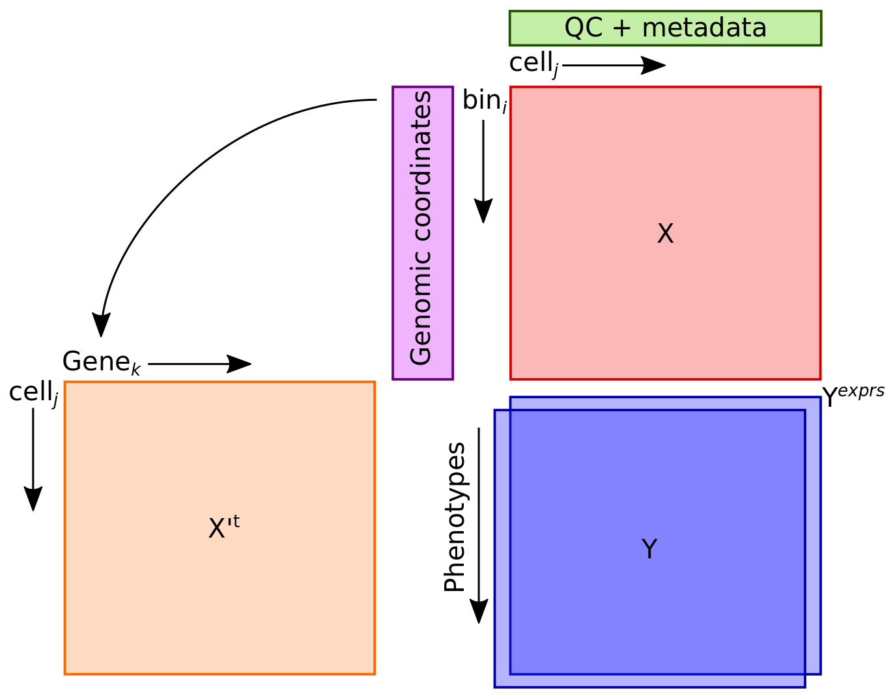
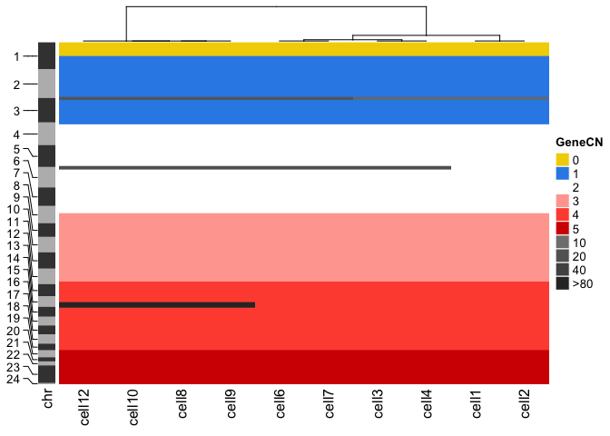
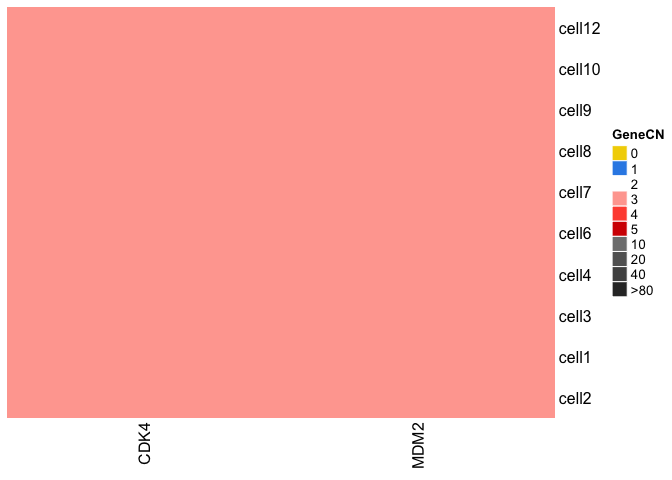

<!-- README.md is generated from README.Rmd. Please edit that file -->

## GAC: Genetic Analysis of Cells

------------------------------------------------------------------------

<!-- badges: start -->

[](https://www.tidyverse.org/lifecycle/#maturing)
[](https://github.com/r-lib/usethis/actions)
[](https://codecov.io/gh/SingerLab/gac?branch=master)
[](https://travis-ci.com/SingerLab/gac)
[](https://CRAN.R-project.org/package=gac)
<!-- badges: end -->

# GAC is currently under alpha testing

The goal of GAC is to deliver a formal end-to-end analysis by
integrating proven methods of quantitative genetics, statistics, and
evolutionary biology for the genetic analysis of single-cell DNA copy
number. GAC implements a simple, lightweight, and open-source R
framework (Figure 1). Inspired, but unlike Seurat and Scanpy, adapts 
the logic of espressioSet/AnnData into relational matrices in native R which facilitates the
integration of algorithms for the downstream analysis of single-cell DNA
data which is so desperately needed. 

GAC facilitates the downstream analyses of segmented data with common segments by
concurrently managing the X, and Y across all cells or samples e.g. the
output of [Varbin/Ginkgo](https://github.com/robertaboukhalil/ginkgo),
[FACETS](https://github.com/mskcc/facets), [MUMdex](http://mumdex.com),
[HMMcopy](https://bioconductor.org/packages/release/bioc/html/HMMcopy.html),
or [SCOPE](https://github.com/rujinwang/SCOPE). The unsegmented bin read
counts is *not a correct* input. GAC uses
[ComplexHeatmap](https://jokergoo.github.io/ComplexHeatmap-reference/book/),
an ultra-powerful tool for heatmaps to help visualize the data.

To implement GAC we require five easy-to-generate inputs: 
- a copynumber / genotype matrix (X) (bins\[i\] x cells\[j\])
- a phenotype matrix (Y) (cells\[j\] x phenotype\[*y*\])
- a qc matrix (technical wet-lab notes) (qc) (cells\[j\] x qc\[*c*\])
- a gene to bin index (gene.index)
- the genomic coordinates of the bins or genotypes (chromInfo)
- and an optional expression matrix (Ye; for DNA-RNA or same-cell G+T([Macaulay, et
al.2015](https://dx.doi.org/10.1038/nmeth.3370)) (under development)



## Installation

### Dependencies:

-   [ComplexHeatmap](https://jokergoo.github.io/ComplexHeatmap-reference/book/)
-   [ConsensusClusterPlus](https://bioconductor.org/packages/release/bioc/html/ConsensusClusterPlus.html)
-   [vegan](https://github.com/vegandevs/vegan)
-   [dplyr](https://dplyr.tidyverse.org)
-   [SCclust](https://github.com/KrasnitzLab/SCclust)

### Install dependencies
```
install.packages("devtools")
devtools::install_github("KrasnitzLab/SCclust")

install.packages("BiocManager")
BiocManager::install(c("ComplexHeatmap", "ConsensusClusterPlus"))
```

You can install the development version from
[GitHub](https://github.com/) with:

```
devtools::install_github("SingerLab/gac")
```

## Examples

This is a basic example for drawing a copy number heatmap. For a
comprehensive overview of the package please follow the
`getting_started.Rmd` in the `vignettes/`

``` r
library(gac)

## basic example code
data(cnr)

( excl.cells <- rownames(cnr$qc)[cnr$qc$qc.status == "FAIL"] )
#> [1] "cell5"  "cell11"

cnr <- excludeCells(cnr, excl = excl.cells)

aH <- HeatmapCNR(cnr, what = 'X', col = segCol, show_heatmap_legend = FALSE)

draw(aH, annotation_legend_list = list(legSeg))
```



``` r
bH <- HeatmapCNR(cnr, what = "genes",
                 which.genes = c("CDK4", "MDM2"),
                 col = segCol, show_heatmap_legend = FALSE)
#> Warning: The input is a data frame, convert it to the matrix.

draw(bH, annotation_legend_list = list(legSeg))
```



### Motivation and design

This package came out of the need to deliver some results on borrowed
time. During the 11th hour, I saw I was spending 85%
phenotypes), 10% rendering heatmaps, and 5% looking at 
my time keeping multiple synchronized tables of bins, annotations,
genes, and results. I began to think how lucky the people who only
work with single-cell RNAseq are to have tools like Seurat and Scanpy,
how simple and flexible those two tools are, and how nothing for DNA
copy number is as powerful as the sister tools Seurat and Scanpy to
manage the copy number matrix. I eventually realized that the main
difference is the restriction imposed by the genome coordinates.
While staring at the AnnData diagram I realized that for copy number
data, the unit is a `bin` and the .X should be a matrix of common
`bins` for all cells. However, to make biological sense of the data,
**gene level resolution** is required. Thus, building a synchronized
matrix with genes is of utmost importance. Having an internal
gene-to-bin index (gene.index) allowed the flexibility to
interpolate the bin data to gene-level resolution and integration to
the complete set of phenotypes, and QC data.

The need to have a simple tool to manage input and output reduced
85% of the time spent synchronizing bins, genes, phenotypes, and QC
matrices capable of handling a large data set of &gt;24,000 cells 
was greatly needed. Knowing the data is growing by the
week.  Functions to handle the n+1 problem are integrated via `addCells`.

We hope you enjoy !

-   Rodrigo, et al.

# What’s in the works

-   Integration with MLR for non-linear genetic models

-   Integration with CORE and GISTIC2 for finding focal and recurrent
    events

-   Integration of infScite for somatic alteration evolution

-   Integration with Pathview for KEGG pathway visualization

-   support for .seg files

-   Cleaner code with tidyverse

-   CRAN testing

# Licence

GAC framework and code is distributed under a BSD-3 License
