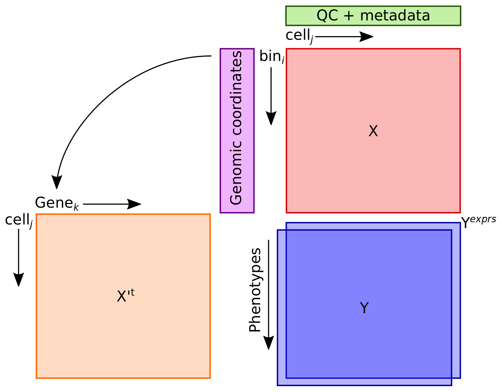

```{r, include = FALSE}
knitr::opts_chunk$set(
  collapse = TRUE,
  comment = "#>"
)
```

```{r setup}
library(gac)
```

# Getting Started

GAC comes bundle with example data.  This data is composed of 12 fake cell copy number profiles with deletions, losses, gains and amplifications along 5000 bins.  Additionaly for the 12 cells, are examples of binary, categorical, and quantitative phenotypes, and some QC data. 

The primary container to handle the complexity of single-cell DNA data is a CNR bundle.

The cnr bundle is composed of a genotype (integer copy number) matrix, *X*, phenotype matrix *Y*, _expression_ matrix *Ye* , a QC or metadata matrix *qc*, the *chromInfo* with chromosome-end coordinates, and a *gene.index* to map bins to specific genes.  These are user provided tables.  See documentation for `buildCNR` to learn how to build a CNR bundle with your data.

The CNR is modeled after the expressionSet and AnnData objects from R/Bioconductor and Python, respectively.  It is a lightweight and versitile framework to operate and manipulate large single-cell DNA data.  For statistical analysis, the framework facilitates the use matrix operations by concurrently managing genotype and phenotype data.

As a new user it's important to familiarize youself with the CNR.  At the heart of the CNR bundle is the genotype *X* matrix wich hold copy number as ploidy corrected `numeric` estimations or `integer` states, with bins as rows, and cells as columns.  Bins can be the direct output from Ginkgo/Varbin algorithm, or the a set of common segments from a .seg file in `matrix` form.

The bin information is located on the `chromInfo` table, and the gene-to-bin mappings on the `gene.index`, which helps link the output of the segmentation to a biological context.

Cell/sample phenotypes are housed in the *Y* matrix, these are sample specific and biological in nature. These are the phenotypes we wish to gain biological insights.

In a not so distant future, the posibility to acquire single-cell DNA and RNA from the same cell will become feasable at scale.  To this end, a *Ye* or _exprs_ matrix is included in the bundle, as for purposes of genetic analysis _gene expression_ is a phenotype.  If you have data of this type, it's best to have the last/most-accurate, curated, and complete data possible for the analyses to make sense.  Eg. scaled, log2-transformed, MAGIC Imputed, without duplets.

Lastly, a *qc* matrix containg metadata about each cell is also required.




Figure 1. Schematic representation of the CNR bundle and how the different components are related.

### View what data is present in the cnr
```{r data}
data(cnr)
sapply(cnr, tibble)
```

### make sure numbers of cells match in all objects
```{r work.with.cnr}
sapply(cnr, dim)
```

I made use of [ComplexHeatmap](https://jokergoo.github.io/ComplexHeatmap-reference/book/) for this package.  ComplexHeatmap is one of the most powerful visualization tools available for R.  To use the richness of ComplexHeatmap, the `HeatmapCNR` function attempts to minimize the total number of presets.  Please visit the ComplexHeatmap documentation to take advantage of its potential.

The `HeatmapCNR` function will create a viable plot if you are in a time constraint.


```{r visualize}
## a color scale to visualize the integer copy number is provided
## visualize genome-wide
data(cnr)
data(segCol)

HeatmapCNR(cnr, col = segCol)

## visualize genes of interest
HeatmapCNR(cnr, col = segCol, what = "genes", which.genes = c("CDK4", "MDM2", "TP53"))

```

## Working with a CNR

GAC is equiped with a couple of management functions that are prefixed with `add*`, `exclude*` and `keep*`.  

On a more frequent basis you will want to remove cells that have noisy profiles.  

For example to exclude cells that you have been deemed as "FAIL" b/c of low read counts you can do:

```{r remove.cells}
## remove cells
( excl.cells <- rownames(cnr$qc)[cnr$qc$qc.status == "FAIL"] )
cnr <- excludeCells(cnr, excl = excl.cells)
sapply(cnr, dim)

HeatmapCNR(cnr, col = segCol)

```

Conversly, if you have multiple samples or have multiple conditions and wish to use only part of the data, you can use `keepCells`

e.g.
```{r keep.cells}
## keep cells
( keep.cells <- colnames(cnr$X)[-c(11:12)] )
cnr <- keepCells(cnr, keep = keep.cells)
sapply(cnr, dim)

HeatmapCNR(cnr, col = segCol)

```

Lastly, if you perform a new experiment, and need to add additional cells  use the `addCells`

```{r add.cells}
## make new cells
newX <- data.frame(cbind(rep(c(5,2), c(3000, 2000)),
                         rep(c(2,4),  c(3000, 2000))))
names(newX) <- paste0("cell", 13:14)
head(newX)

tail(newX)

## creating new phenotypes
newY <- head(cnr$Y, n = 2)
newY$cellID <- paste0("cell", 13:14)
rownames(newY) <- newY$cellID

newY[, c(6:9)] <- newY[,c(6,9)]+3
newY

## creating new QC
newQC <- head(cnr$qc, 2)
newQC$cellID <- paste0("cell", 13:14)
rownames(newQC) <- newQC$cellID

newQC[,2:4] <- newQC[,2:4] + 2
newQC

## add cells
cnr <- addCells(cnr, newX = newX, newY = newY, newqc = newQC)
sapply(cnr, dim)
HeatmapCNR(cnr, col = segCol)
```

For developers, if you run an algorithm to estimate genomic complexity or another parameter, you can add these to the Y matrix using `addPheno`

```{r add.phenotypes}
## addPheno
rand3 <- data.frame(cellID = cnr$Y$cellID, rand3 = rnorm(nrow(cnr$Y), mean = 2, sd = 1))

cnr <- addPheno(cnr, df = rand3)
sapply(cnr, dim)

head(cnr$Y)

```

Similarly, if you run a qc metric such as Median Absolute Pairwise Deviance (MAPD) which is used to estimate how noisy the profiles are.  This estimate should be computed on the non-segmented bin estimates (this is not the right input for GAC as it requires you provided it segmented results). See documentation for [Ginkgo/Varbin](https://github.com/robertaboukhalil/ginkgo), MUMdex(http://mumdex.com), HMMcopy(https://bioconductor.org/packages/release/bioc/html/HMMcopy.html), or SCOPE(https://github.com/rujinwang/SCOPE) for details on how to perform the upstream analysis.

To add QC metrix use the `addQC`

```{r add.qc}
## add QC
mapdX <- data.frame(t(apply(cnr$X, 2, mapd)))
mapdX <- data.frame(cellID = rownames(mapdX), mapdX)

cnr <- addQC(cnr, df = mapdX)

head(cnr$qc)

```

Lastly, the goal of this tool is to facilitate the genetic, and statistical analysis of single-cell copy number data.  Most analysis will be carried out at the bin level.  Even if you aim to work with a single gene, the bin is the smallest independent unit for segmented data.  To add, for example, p-values to see which bins are linked to your phenotype the helper function is `addInfo`.


```{r addInfo}
## addInfo

fakePval <- data.frame(fakePval = runif(5000))

cnr <- addInfo(cnr, df = fakePval)

head(cnr$chromInfo)

```

## Clonal decomposition of cell populations based on copy number

Two methods are implemented: Heriarchical clustering, and Consensus Clustering

### Heirarchical Clustering

For this method we estimate Bray-Curtis Dissimilarty across all pairwise cells.  Heirarchical clustering is
then performed on the complete matrix with `phyloCNR`.   To set the tree height and asign cluster membership,
we iteratively test various heights, and count the number of one-cell clusters, and multi-cell clusters.  This
is done with `optClust`.  The optimal height is set to the intersection between one-cell and multi-cell clusters. 
Bray-Curtis dissimilarity based clusters are then set using `setBrayClusters`.  The package `ape` contains 
various functions to visualize heirarchical trees, a tree object class `phylo` is created to faciliate this.  Bray-Dissimilarity membership is saved to the phenotype table `Y` as  `BrayC`.

```{r bray_diss_+phylo}
cnr <- phyloCNR(cnr)

( mopc <- optClust(cnr) )

plotCL(mopc)

sc.tree.height <- 0.065

cnr <- setBrayClusters(cnr, tree.height = sc.tree.height)
```

#### Single-cell dendrogram with tree height for cluster membership
```{r plot_hierarchical_dendrogram}
plot(cnr[["hcdb"]])
abline(h = sc.tree.height, col = "#D40000")
```

#### Other tree types from package ape using the `phylo` class
```{r plot_phylo}
cnr[["phylo"]]
plot(cnr[["phylo"]])

plot(cnr[["phylo"]], type = 'fan')
```

## Consensus clustering
We implement [ConsensusClusterPlus](https://bioconductor.org/packages/release/bioc/html/ConsensusClusterPlus.html) using the function `consensusClusterCNR` directly on the CNR.  Optimum number of clusters is based on the maximum number of stable clusters ([Meyer et al. 2013](https://arxiv.org/abs/1408.0967)).  Stable Cluster membership is saved to the phenotype table `Y` as  `ConsensusC`.  K parameter (kCC) and number of stable clusters (sK) are saved into `cnr[["optK"]]`.  The table of kCC, and kS is saved as `cnr[["kStats"]]`.

```{r cc_clust}
data(ccClustCol)
cnr <- consensusClusterCNR(cnr, maxK = 8)

cnr <- doKSpectral(cnr)

cnr$kStats

cnr$optK

cnr <- setKcc(cnr)

plot_ccp(cnr, k = 8, col = ccClustCol)

HeatmapCNR(cnr, col = segCol,
           column_split = cnr$Y$ConsensusC,
           column_gap = unit(0, "mm"),
           top_annotation =
               HeatmapAnnotation(df = cnr$Y[, c("BrayC", "ConsensusC")]))
```


## Cluster heterogeneity

Sample heterogeneity based on clustering can be estimated using `cluster_heterogeneity`.  The function returns a table with the same name containing the counts of each cluster, frequency, and other stats.  Furthermore, it returns a vector in the phenotype table `Y` named `final_cluster`.  There is no default cluster_column to use, one must choose either BrayC, ConsensusC, or if clustering was done outside GAC, these clusters can be imported to `Y` to be used here.

```{r cluster_heterogeneity}
cnr <- cluster_heterogeneity(cnr, cluster_column = "BrayC")

cnr$cluster_heterogeneity
```

## Cluster Summary Profiles
The function `get_cluster_profiles` is used to summarize the genetic profile of each cluster.  Cluster summary profiles are saved in `cnr[["DDRC.df"]]`.
```{r cluster_profiles}
cnr <- get_cluster_profiles(cnr)

Heatmap(cnr$DDRC.df, col = segCol, cluster_rows = FALSE, cluster_columns = FALSE,
        column_labels = paste(names(cnr$uclust), "(n =", cnr$uclust, ")" ))
```

## VDJ genotyping
To asses weather T-cells or B-cells are present in the cell populations, the function genotype_vdj will classify cells containing VDJ deletions into T-cells, B-cells, or vdj.unspecified. A visualization function is also provided.


```{r vdj_genotyping}
cnr <- genotype_vdj(cnr)

vdjHeatmap(cnr)

```

## Session Informatioin
```{r sessioninfo}
date()
sessionInfo()

```
